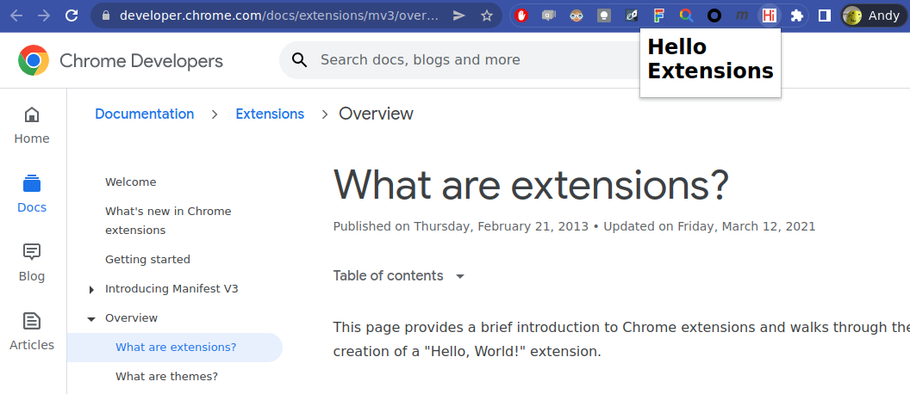

# Hello Chrome Extensions
This is a step by step implementation of the Chrome Extensions "Hello World" from https://developer.chrome.com/docs/extensions/mv3/overview/.

## How to install
After cloning this repository into a directory, follow these steps:
1. Navigate to chrome://extensions in your browser. You can also access this page by clicking on the Chrome menu on the top right side of the Omnibox, hovering over More Tools and selecting Extensions.
1. Check the box next to Developer Mode.
1. Click Load Unpacked Extension and select the directory for your "Hello Extensions" extension.

## Screenshot
<kbd></kbd>
